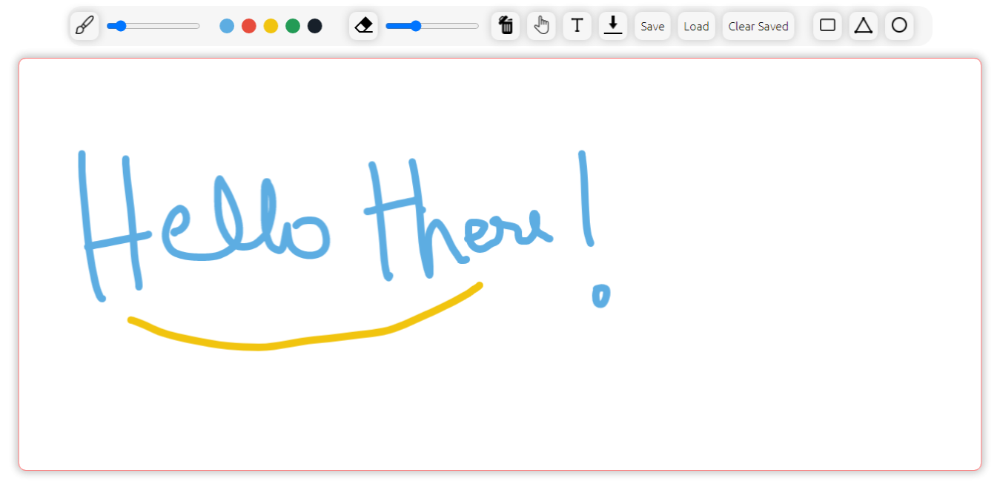

# Freehand
### A collaborative whiteboard made with Fabric.js.   


### Features: 
- Collaborate with another person in 'real-time' - What you see on one screen is what you see on the other screen simultaneously.
- Brush with assorted color options
- Create Text boxes 
- Create Shapes 
- Download the Canvas content with one-click
- Desktop and Tablet screen responsiveness
- Can clear the Canvas data from the database by using the 'clear canvas' button.


### Tech stack
* HTML 
* CSS 
* React.js
* Firebase Firestore
* Firebase Hosting


## Try it live here: https://freehand-e8cc2.web.app/


### How to test "Freehand" app

- Open the live demo website seen above in "Two separete chrome windows" (Press Ctrl + N twice in chrome)
- Bring the two chrome windows side by side so that each windows content is visible
- Hit refresh( or F5) on both windows to make it responsive to the current screen size
- In the 1st chrome window, draw something on the canvas
- In the 2nd chrome window, you can see that the same content of 1st windows is being displayed (if the content is not being display at first Press "Load" Button)
- Now both screen's are synced at the same time. Happy scribbling!


### Installation guide

1. `npm i` - to install dependencies
2. create a `firebase.js` file inside 'src' folder
3. Copy the following code into `firebase.js` file  
```
import firebase from "firebase";

//********COPY AND PASTE FIREBASE CONFIG FILE BELOW**********


// Initialize Firebase
firebase.initializeApp(firebaseConfig);

export const db = firebase.firestore();

```
4. In the given space above, copy and paste the config details of your firebase app.
5. `npm start` - to view React app in the browser